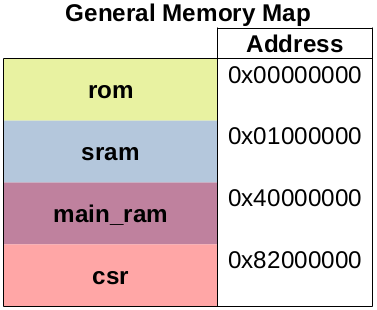
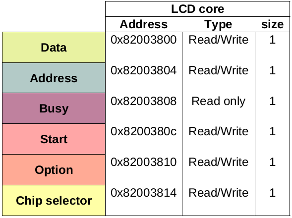
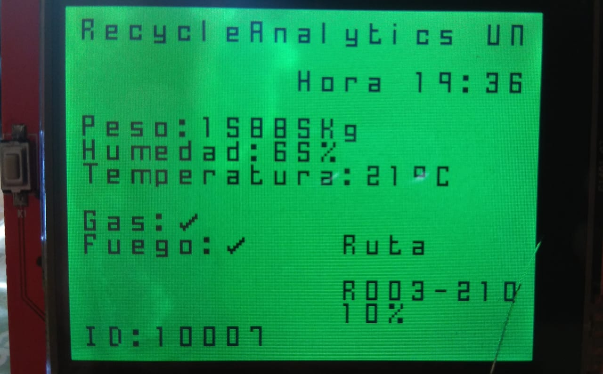

# Human Machine Interface for garbage truck
HMI used to show information about truck status and collection plan.

## El proyecto

Este proyecto es un desarrollo de los sistemas embebidos enfocado al IoT que busca sistematizar y recolectar la información de toda la infraestructura de contenedores y vehículos que componen el sistema de desechos solidos de una ciudad. El objetivo de este proyecto es facilitar y analizar la informacion en tiempo real del las basuras desechadas en los espacios publicos destinados a esto. Por medio de sistemas digitales y las redes de telecomunicaciones se pretende implementar sensores que reconozcan el contenido de los contenedores que se encuentran distribuidos a los largo de la ciudad, enviar la información a tráves de internet y presentarla en una aplicación web. Este proyecto incluye la monitorización de los vehículos designados a la recoleccion movil de desechos. Con esto se espera que el sistema de recolección de desechos tenga una base de datos disponible para estudiar y analizar la evolución en el tiempo del proceso de almacenamiento y recolección de basuras, de esta manera lograr entender el comportamiento de los ciudadanos al depositar sus respectivas basuras en los sitios correspondientes y hacer mas eficiente el proceso de recolección en la ciudad.

### Especificaciones

* Pantalla a color RGB LCD de resolución 240x320.
* Procesador de 32 bits (VexRiscV).
* Frecuencia del reloj: 100MHz.
* Memoria ROM integrada de 8Kb.
* Memoria RAM de 4Kb.

## Soc

### VexRiscV

A nivel técnico el proyecto se compone de una implementación de un System On Chip (SoC), con el procesador SoftCore VexRiscV y los correspondientes periféricos. La comunicación entre el procesador y los periféricos es mediante la implementación del bus Wishbone.

La pantalla de visualización es el chip ILI9341 que se comunica en paralelo con el soc. Para controlar la pantalla se diseñó desde el hardware un periférico que escribe en los registros de la pantalla, para comunicar el soc con un computador se usa el periferico UART. 

## Hardware

### Mapa de memoria general del SOC 

El mapa de memoria general del SoC es el siguiente

### LCD Paralelo

El periferico diseñado en este proyecto fue un controlador del chip de la pantalla ILI9341. Para realizar este diseño se tuvieron en cuenta dos cosas:

* Registros de control y direcciones de comandos del chip ILI9341.
* Diagrama de tiempos del chip.

El shield del chip de la pantalla tiene los siguientes pines:
* DB[7:0]
* RS
* WR
* RST
* CS
* RD

Como se trata de un solo esclavo (la pantalla LCD) que manejará el periférico, el pin CS se deja permanentemente en nivel bajo; de la misma manera el periférico solo escribirá datos en el esclavo, mas no leerá registros de este, por lo que también el pin RD (que habilita lectura/escritura de los registros del chip) se dejará constantemente en nivel bajo.

El diagrama de tiempos que provee el fabricante de la pantalla se muestra a continuación.

Tener en cuenta los tiempos mínimos y máximos establecidos en la hoja de datos del chip ILI9341.

El periférico diseñado realiza la tarea descrita en el diagrama de tiempos; hace dos tareas diferenciadas:
* Escribir un dato en la salida a modo de instrucción (seleccionar una dirección de registro, RS nivel bajo).
* Escribir un dato en la salida a modo de argumento (guardar un dato en el registro seleccionado, RS nivel alto).

El módulo está diseñado con la herramienta LiteX mediante el uso del submódulo FSM (ver documentación de creación de máquinas de estado finitas en litex).

El mapa de memoria se relaciona a continuación.

Las señales de control START y BUSY respectivamente da inicio al ciclo de escritura y asegura que no se realice un ciclo mientras se este realizando otro en ese momento. Para efectos de generalidad, se deja como registro el valor que se escribe en el pin CS, para casos en los que se necesite manejar más de una pantalla. Queda pendiente realizar la generalidad para el caso en que se necesite leer datos de los registros del chip.

La diagrama de estados del modulo lcd_core se muestra a continuación. 

Para relizar una escritura en la pantalla se deben escribir los registros del periferico en este orden, para escribir en la dirección "address":

* address   ->  ADDR
* 0x00      ->  DATA
* 0         ->  OPTION
* 1         ->  START

Un ciclo de relog después

* 0         ->  START
* wait BUSY ==  0

Para escribir datos o parametros ("data") a los comandos de la pantalla se ejecuta una secuencia similar con la diferencia de que la opción de datos es "1".

* 0x00      ->  ADDR
* data      ->  DATA
* 1         ->  OPTION
* 1         ->  START

Un ciclo de relog después

* 0         ->  START
* wait BUSY ==  0

Estas funciones de escritura en los registros se detallan en la sección de firmware.

## Resultado final

## Referencias

Para el desarrollo del proyecto ses usaron distintas herramientas, sus fuentes e instructivos se muestran a continuación:

- [Migen](https://m-labs.hk/gateware/migen/): Descripción de hardware en python
- [Litex](https://github.com/enjoy-digital/litex): Construcción e interconección del Soc
- [VexRiscv](https://github.com/SpinalHDL/VexRiscv): Cpu del soc
- [Vivado](https://www.xilinx.com/products/design-tools/vivado.html): Herramienta de síntesis de Digilent
- [Custom Fonts for microcontrollers](https://jared.geek.nz/2014/jan/custom-fonts-for-microcontrollers): Generador personalizado de fuentes para microcontroladores

