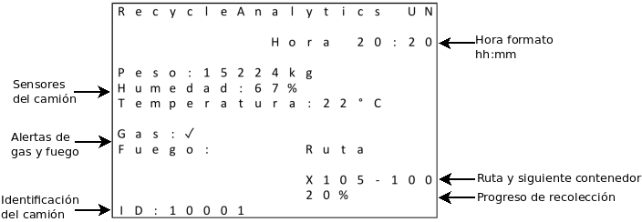

# HMI firmware
Firmware to write registers and print characters.

## Interfaz HMI

Para mostrar información al operario se diseña la interfaz de esta forma: 

Para lograr esto se usan las funciones relacionadas a continuación:

## Escritura en registros de la LCD

El firmware usado para la parte gráfica está en la librería [lcd](lcd.h), las funciones principales se describen a continuación.

Para escribir el periférico de la pantalla se usan dos funciones:

- lcd_write_Oaddr(unsigned char address)
- lcd_write_Odata(unsigned short int value)

Estas funciones siguen el algoritmo descrito en la sección del hardware. Para inicializar la pantalla ses usan las funciones anteriores de tal forma que se configure correcatamente la pantalla, siguiendo las instrucciones del datasheet.

## Funciones de manejo de la pantalla

- lcd_initialize(void)

La pantalla tiene la opción de escribir en una sección, que para este caso es de 8x8px y luego enviar la información de cada pixel en formato RGB 16bits. Para esto se usan las funciones:

- preparePrint(uint16_t posx, uint16_t posy, uint8_t width, uint8_t height)
- drawPixel(uint16_t color)

Para imprimir un caracter en la pantalla se usa la siguiente función, que lee la información de cada simbolo en la librería [homespun font](homespun_font.h) e imprime cada pixel de la sección establecida anteriormente con el color que se indica en los parámetros de la función.

- printCharacter(uint8_t c, uint16_t posx, uint16_t posy, uint16_t fontColor, uint16_t background)

Si se usa la función anterior por cada caracter se puede imprimir un string en pantalla, esto se hace con la función:

- printString(char *c, uint16_t posx, uint16_t posy, uint16_t fontColor, uint16_t background)

Al usar las funciones anteriores se da funcionalidad a la interfaz con las siguientes funciones.

- initHMI(void): imprime los textos que no cambian en la pantalla
- printOffScreen(void): Imprime la pantalla de apagado

La información llega del maestro con el formato:

{OnOffState , id   , Hora    , Peso , Humedad, Temperatura, Gas,   Fuego, Ruta, SigContenedor, Progreso}

{1 ,10007, 19:36:10, 15885, 65,      21,          0,     0,     R003, 21,            10}

Para imprimir esta información se usa la siguiente función que recibe como argumento el string con el formato apropiado. 

- printData(char *c)
